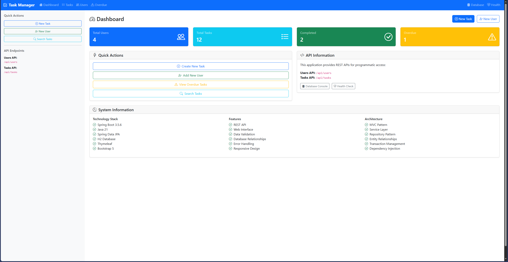

# Task Management System

Spring Boot application with REST API and web interface for managing users and tasks.



## Technology Stack

- Spring Boot 3.5.6
- Java 21
- Spring Data JPA
- H2 Database
- Thymeleaf with Layout Dialect
- Bootstrap 5
- Gradle
- Jackson (JSON processing)

## Features

- User management (CRUD)
- Task management (CRUD)
- Task assignment to users
- Task status tracking (Pending, In Progress, Completed, Cancelled)
- Task priorities (Low, Medium, High, Urgent)
- Due date tracking
- Overdue task detection
- Search functionality
- REST API endpoints with DTOs
- Responsive web interface with dark mode toggle
- Auto-filtering functionality
- Sample data initialization

## Running the Application

```bash
./gradlew bootRun
```

Access the application at http://localhost:8080

## Database Access

H2 Console: http://localhost:8080/h2-console
- JDBC URL: jdbc:h2:mem:taskdb
- Username: sa
- Password: password

## API Endpoints

All API responses use DTOs to prevent circular references and provide clean JSON output.

### Users
- GET /api/users - Get all users
- GET /api/users/{id} - Get user by ID
- GET /api/users/username/{username} - Get user by username
- GET /api/users/email/{email} - Get user by email
- POST /api/users - Create new user
- PUT /api/users/{id} - Update user
- DELETE /api/users/{id} - Delete user

### Tasks
- GET /api/tasks - Get all tasks
- GET /api/tasks/{id} - Get task by ID
- GET /api/tasks/user/{userId} - Get tasks by user
- GET /api/tasks/status/{status} - Get tasks by status
- GET /api/tasks/priority/{priority} - Get tasks by priority
- GET /api/tasks/user/{userId}/status/{status} - Get tasks by user and status
- GET /api/tasks/overdue - Get overdue tasks
- POST /api/tasks - Create new task
- POST /api/tasks/user/{userId} - Create task for specific user
- PUT /api/tasks/{id} - Update task
- PATCH /api/tasks/{id}/complete - Mark task as complete
- DELETE /api/tasks/{id} - Delete task

## Project Structure

```
src/main/java/com/example/demo/
├── controller/
│   ├── api/     # REST controllers with DTO responses
│   └── web/     # Web controllers with Thymeleaf views
├── dto/         # Data Transfer Objects for API responses
├── model/       # JPA entities with @JsonIgnore annotations
├── repository/  # Data repositories with custom queries
├── service/     # Business logic layer
└── config/      # Configuration and data initialization

src/main/resources/
├── templates/   # Thymeleaf templates with layout system
│   ├── layout.html     # Base layout template
│   ├── users/          # User management templates
│   └── tasks/          # Task management templates
└── application.properties  # Application configuration
```
